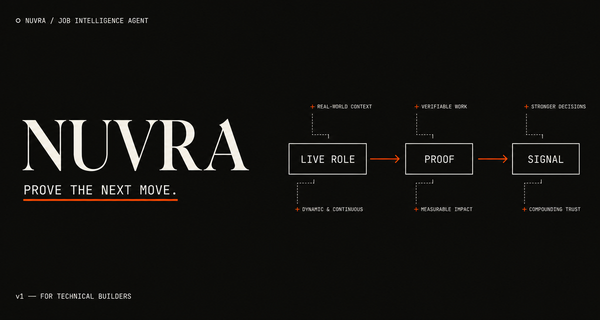
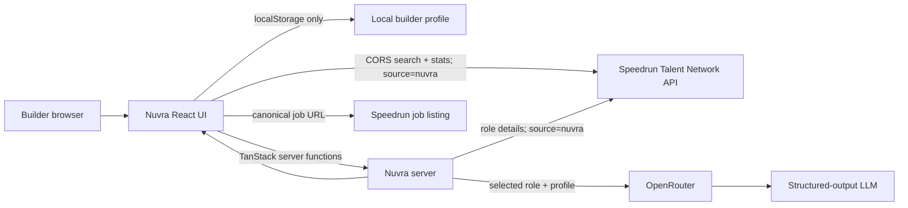

# Nuvra



Nuvra is a no-login, proof-first job agent for high-agency builders. It reads
live openings from the Speedrun Talent Network, lets a builder keep a private
local profile, discovers roles from that profile, and produces evidence-grounded
fit reports, proof projects, and application drafts.

It does not submit applications, guess hidden companies, or copy full job
descriptions. The goal is to turn a live role into grounded evidence: a fit
report, a small proof project, and an honest application draft.

## What it does

- Loads live roles, facets, role details, and hiring stats from the Speedrun
  Talent Network REST API.
- Filters by search term, function, seniority, location, remote status, and
  portfolio scope.
- Stores the builder profile only in the browser's `localStorage`; no sign-up
  or database is required.
- Discovers live roles from the selected tracks and resume signals, then ranks
  up to 50 candidates with GPT-4o mini. A deterministic ranking remains available
  when the model is unavailable.
- Uses OpenRouter for the explicit profile scan and for a selected open role:
  fit report, proof-project brief, and application draft.
- Links every job to Speedrun's canonical listing and preserves the API's
  stealth masking.

## Architecture



## Run locally

Requirements: Node.js 20 or newer and an OpenRouter API key.

```sh
npm install
copy .env.example .env
npm run dev
```

Open [http://127.0.0.1:3000](http://127.0.0.1:3000).

Set these values in `.env` before starting the server:

```dotenv
OPENROUTER_API_KEY=your_key_here
OPENROUTER_MODEL=openai/gpt-4o-mini
APP_URL=http://localhost:3000
VITE_APP_URL=http://localhost:3000
```

`OPENROUTER_API_KEY` is server-only. Do not add it to a `VITE_` variable, commit
`.env`, or paste it into the browser. GPT-4o mini is the cost-aware default and
supports OpenRouter JSON-schema structured outputs. Choose another model only if
its OpenRouter model metadata lists `structured_outputs`.

## Data contract and guardrails

The integration uses the documented API at
[speedrun-talent-network.com/developers](https://speedrun-talent-network.com/developers):

| Nuvra action         | Speedrun endpoint          |
| -------------------- | -------------------------- |
| Search and facets    | `GET /api/v1/jobs`         |
| Role analysis source | `GET /api/v1/jobs/{id}`    |
| Dashboard totals     | `GET /api/v1/stats/hiring` |

- Every request identifies the product with `source=nuvra`.
- Live search and dashboard totals use the board's CORS-enabled REST API directly
  from the browser; job-detail and AI actions stay server-side.
- API caching can make listings a few minutes behind the original company board.
- `scope=everywhere` is only used after the builder enables the broader-universe
  control.
- Stealth listings stay as `Stealth`; there is no bypass or reveal parameter.
- Job descriptions are read server-side for analysis but not rehosted in the UI.
- Apply actions remain on Speedrun's canonical listing. Nuvra never applies
  on a user's behalf.
- Speedrun integration feedback can be sent to [talent@a16zspeedrun.com](mailto:talent@a16zspeedrun.com).

## AI behavior

The selected role is fetched fresh before every AI request. The server sends the
role detail and the profile currently stored in the browser to OpenRouter. The
agent is instructed to use only the supplied profile and never invent employers,
repositories, metrics, or credentials.

Structured fit and project outputs are validated with Zod. If a model returns
invalid structured data, the UI shows an error instead of a fake zero-score
report. Application drafts use plain text and are generated only after the
builder selects a format and clicks the button.

## Security and privacy

- Profile data remains in the current browser's `localStorage` until the user
  clears it.
- Opening an AI report sends the selected role and the local profile to the
  configured OpenRouter model. Do not include secrets in the resume field.
- TanStack server functions are protected by same-origin CSRF middleware.
- Server input is Zod-validated and job IDs are URL-encoded before API requests.
- There is no account system, server-side profile store, or automated application
  submission.
- Vercel Web Analytics records deployed page views only; Nuvra does not send resume text,
  profile fields, or AI prompts as analytics events.

## Validation

Run the project checks:

```sh
npm run build
npx tsc --noEmit
npm run lint
```

For a live smoke test, start the dev server, load the radar, complete a local
test profile, click `Find my best roles`, open a role, and verify that the fit
report, proof brief, and an application draft each return. The profile scan and
the selected-role actions are paid AI operations; normal search, filters,
pagination, and stats remain live API reads.

## Project structure

```text
src/routes/app.tsx                 Live radar and local profile workflow
src/routes/role.$id.tsx            Selected-role evidence workspace
src/lib/speedrun.functions.ts      Live Speedrun API adapter
src/lib/shortlist.functions.ts     Deterministic local ranking
src/lib/scoring.functions.ts       Structured fit-report agent
src/lib/proof.functions.ts         Structured proof-project agent
src/lib/application.functions.ts   Application-draft agent
src/lib/ai-gateway.server.ts       Server-only OpenRouter provider
src/start.ts                       Request error and CSRF middleware
```

## Deploy to Vercel

Import this repository into Vercel, add `OPENROUTER_API_KEY`, `OPENROUTER_MODEL`, `APP_URL`, and
`VITE_APP_URL` (for example, `https://nuvra.vercel.app`) in the project's environment variables,
then deploy. `VITE_APP_URL` ensures that social crawlers receive an absolute URL for the Nuvra
preview image. Vercel Web Analytics is enabled automatically for deployed builds and does not
need a browser-side API key.

## License

Released under the [MIT License](LICENSE).

## Limitations

- The app does not verify claims in a resume, GitHub URL, or generated draft.
- A current role can close between the radar response and opening its report.
- AI output is a working draft, not a truth source. Review it before sending it.
